# AI Prompts Log — HW4

This file records the prompts used with the vibe coder throughout the HW4 problems. Each problem section includes the original prompt, any follow-up prompt, and the reason a follow-up was needed.

## Problem 1 — Vibe coder prompts

### Prompt typed

> Problem 1: Vibe coder prompts
>
> Create AI_prompts.md as a running log with one section per assigmment problem and for each problem I need the following section
> -	Problem number and title
> -	The prompot I give you
> -	A follow up prompt if I give it to you with a short explaination of why I needed the followup prompt (what was missing or needed improvement after the fisrt attempt)
> Keep AI_prompts.md updated as we work through each problem

### Follow-up prompt

> always update the Homework/HW4/AI_prompts.md file also with followups

### Why a follow-up was needed

The first prompt set up the file and its three required items per problem. What it did not make
explicit was that a follow-up has to be logged *as it happens*, in the same turn it is given —
so every later prompt in the session, including questions asked about work already delivered,
lands in the log rather than only the prompts that kicked off a new problem.

## Problem 2 — Analyze the database

### Prompt typed

> Problem 2: Analyze the database
>
> See data/campus_customs.db and you need to understand the database structure and dtaa especially the catalogue, inventory, and users table
>
> Create output/harness.md and lists each table, all of its fields, and a short explaination of why each field matters for the shop or chatbot

### Follow-up prompt

No follow-up prompt was needed for Problem 2.

### Why a follow-up was needed

Not applicable. The first prompt named the database to inspect, the tables to focus on, the output file to create, and exactly what each table's section had to contain (every field plus why it matters).

## Problem 3 — Build the Campus Customs website

### Prompt typed

> Problem 3: Build the Campus Customs website
>  I need you to build the Campus Customs customer website
>
> Create a React + Vite + TypeScript frontend with a Campus Customs/Yale-inspired look Research yalebulldogblue.com for the general visual style and useful Campus Customs info but do not copy and paste the wording for Home and About Us get the infor from the website (do not invent anything) but write it in your own words
>
> There needs to be a top navigation with
> - Home
> - Products
> - About Us
> - Log in
> - Create account
>
> In the Products page show the actual products form data/campus_customs.db and include images, names, prices, and short description
>
> Each product card needs to open its own product detail page with a larger image. And full product info, including description, price, and size/stock info
>
> Add a floating chat interface in the bottom right, for now make it look usable but it can jus be a stub (it will call the backend later on in the problems)
>
> Since later (ij future problems) you'll need a small API to read the DB, now create a simple FastAPI app in backend/main.py to read products, inventory, and images

### Follow-up prompt

> add the attached screenshots to the Homework/HW4/AI_prompts.md file in the Problem 3 section

and then

> also add this one i just attcahed here

### Why a follow-up was needed

The build itself did not need a correction — the first prompt named the stack, the source to
research and the rule against inventing or copying its wording, the five navigation items, what
the product cards and the detail page had to show, that the chat could be a stub, and where the
FastAPI app had to live.

What the first prompt did not ask for was evidence that the site actually runs. The follow-ups
added screenshots of the finished pages to this log, so the result can be seen without starting
the servers. The second follow-up supplied the Home page, which was missing from the first batch
of four.

### Screenshots of the result

**Home page** — the hero, with the top navigation and the store facts drawn from
yalebulldogblue.com.

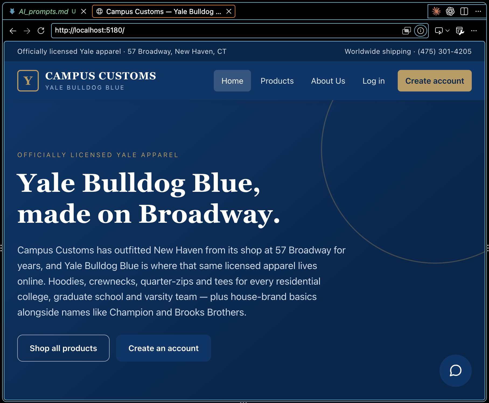

**Products page** — the full catalogue from `campus_customs.db`, with category filter chips and
stock badges on every card.

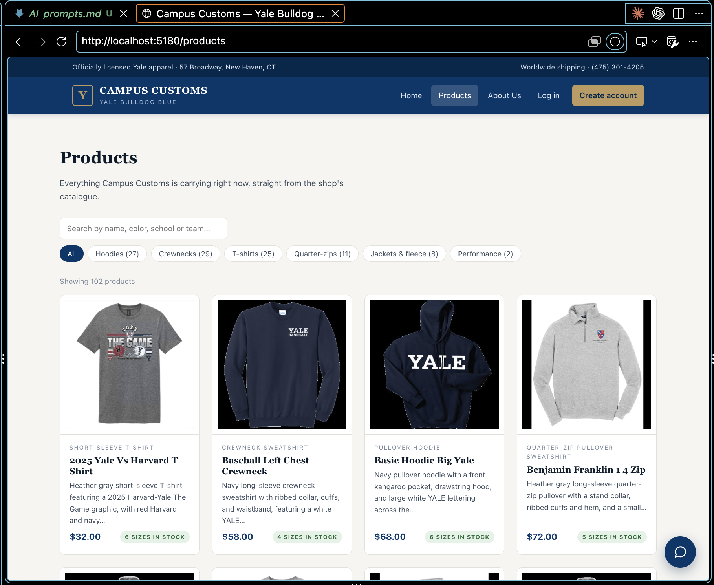

**Product detail page** — larger image, full description, price, per-size stock, colors, product
id and search tags.

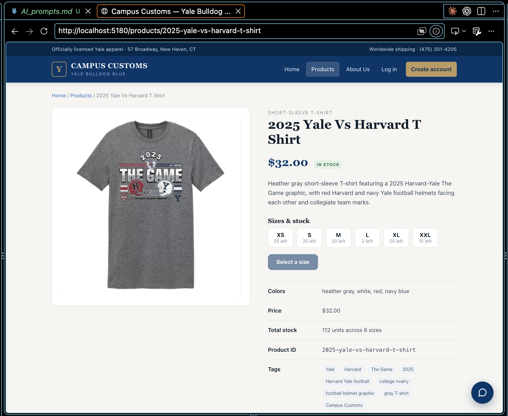

**About Us page** — store information rewritten in our own words from yalebulldogblue.com.

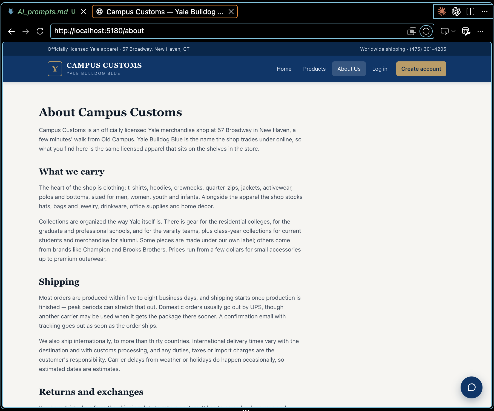

**Floating chat widget** — open, with the greeting and suggested questions.

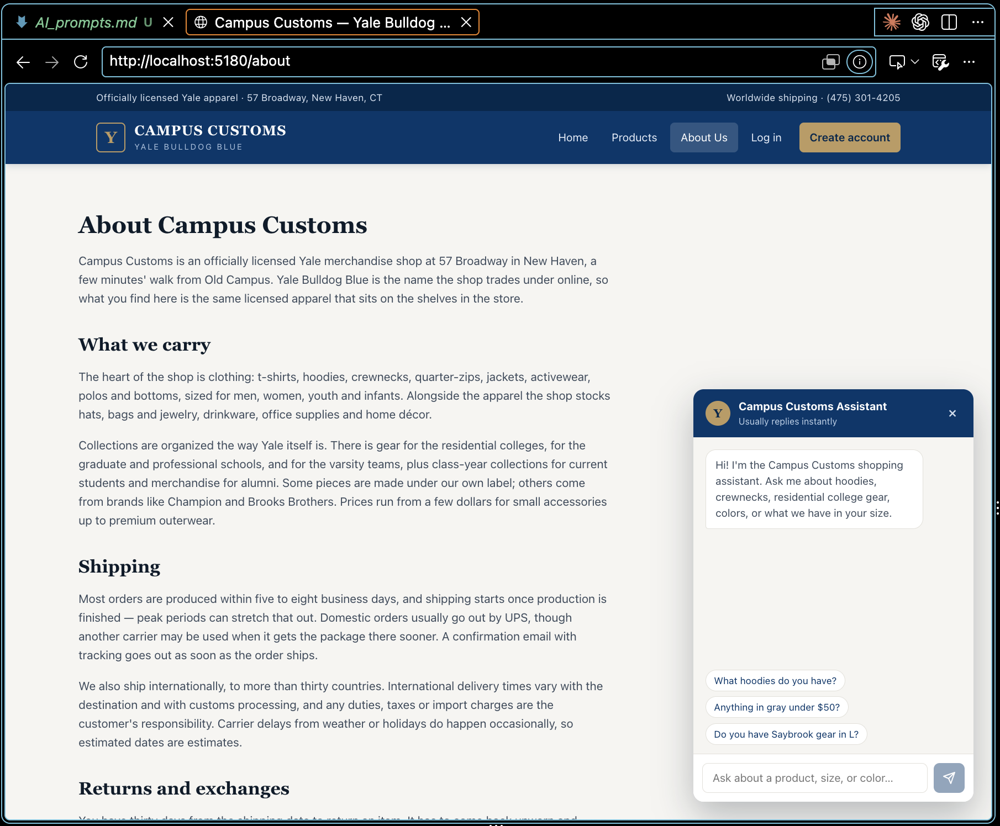

## Problem 4 — Create account and login

### Prompt typed

> Problem 4: Create account and login
>
> Create a create-account / login page working  authentication flow from the existing setup.
>
> -	Create account must  accept first name, last name, email, password, and confirm password.
> -	Login must accept email and password
> The website needs a normal login interface and experience and once the user's logged in it needs a normal interface like all. Wesites that require login so for example sowh username and allow logout
>
> Save new users to the users database and securely hash passwords (never expose posswords it needs to be secure from ai and human hackers)
>
> Use the existing seeded test user:
> -	Email: test@campuscustoms.yale.edu
> -	Password: password
>
> You need to also create a new test account through the site and you need to make sure and confirm that that account too can log in and all is working
>
> Update output/harness.md with a short explanation of how authentication works, what is stored for each user, and how passwords are protected

### Follow-up prompt

> are you saving  new users to the users database ? and are passwords being protected?

### Why a follow-up was needed

The build itself did not need a correction — the first prompt listed the fields each form had to
accept, described the signed-in experience it wanted (show the username, allow logout), set the
security requirement on password storage, named the seeded account that had to keep working,
required a second account to be created through the site and verified, and said what
`output/harness.md` had to explain.

What was missing was *proof* rather than a claim. The first answer described the design; the
follow-up asked to see it demonstrated. That produced three concrete checks: a dump of the real
`users` table showing the account created through the site as row 6; a search confirming the
plaintext password appears nowhere in the database file, the server log, or the source; and a
dictionary attack against the stored digest that found nothing at roughly 65 ms per guess. The
lesson for later problems is to show the evidence alongside the explanation instead of waiting to
be asked.

### Screenshots of the result

**Rejected login** — a wrong password gives one generic message, so it cannot be used to work out
which emails have accounts.

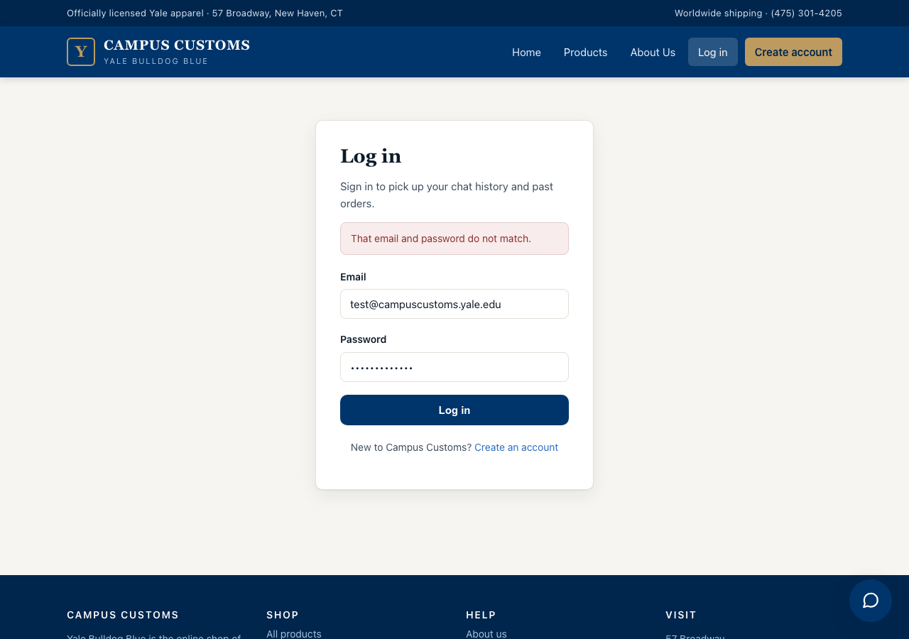

**Create account form**, filled in before submitting.

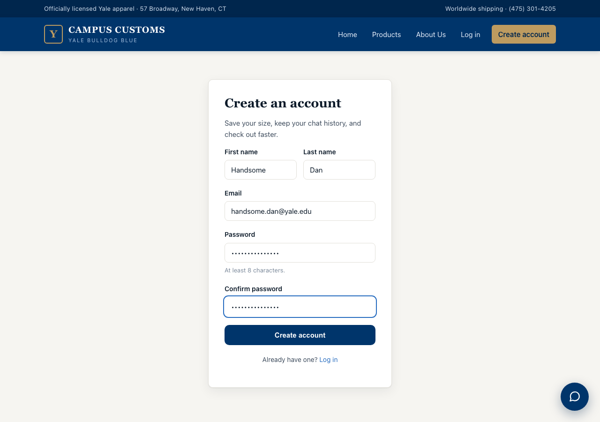

**Signed in as the account created through the site** — the navigation now shows "Hi, Handsome"
and a Log out button.

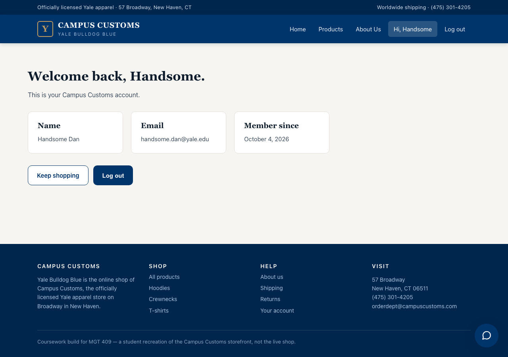

**Signed in as the seeded test user.**

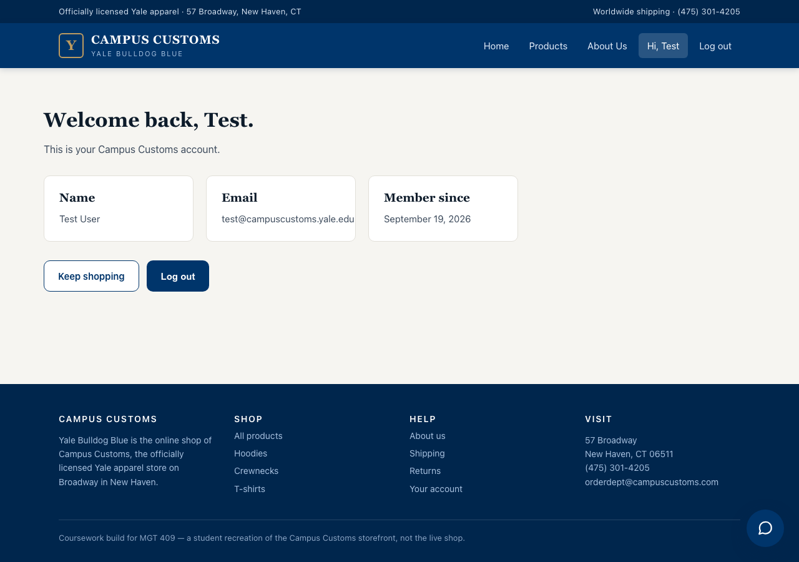

## Problem 5 — PydanticAI agent backend

### Prompt typed

> Problem 5: PydanticAl agent backend
>
> Now you need to turn the existing chat into a real Campus Customs chatbot as a PydanticAI agent behind the existing FastAPI
>
> Keep backend/main.py as the FastAPI app and preserve the working products, images and authentication functionality from the earlier steps
>
> Organize the agent into exactly these existing/new files:
> - backend/prompts/prompt.md , the system prompt (we will expand this in later problems), it needs actual campus customs personality and voice and safety rules
> - backend/agent.py , agent setup and wiring
> - backend/tools.py , tools the agent can call
> - backend/models.py ,  Pydantic/PydanticAI structured types for the agent responses and you need to start/update responses for chat replies / product cards
>
> Keep all safety rules
>
> Expose a chat route in main.py so messages in the website frontend chat go to the PydanticAI agent and its responses come back to the website
>
> Use my model API key from the env, make sure yiu do not hardcode or expose any API key. If you use OpenAI through portkey make sure you use use an allowed 5.6 or 6-series model
>
> Make sure the backend runs from the backend/ folder exactly as required:
> uvicorn main:app --reload --port 8000
>
> Update output/harness.md with a short explanation of how the frontend communicates with FastAPI and how the agent loads its system prompt and model

### Follow-up prompt

> Test the full flow from the website: send a message in the chat widget, confirm FastAPI receives
> it, the PydanticAI agent responds, and the reply appears in the chat

One clarifying question also had to be asked back during the build:

> Port 8000 is held by another uvicorn server you started about 3 days ago (the Harry Potter app,
> PID 94793). The assignment requires `uvicorn main:app --reload --port 8000`. How should I handle it?

Answer: stop the old server and use 8000.

### Why a follow-up was needed

The build itself did not need a correction. The first prompt named the four files and what
belonged in each, required the earlier products/images/authentication work to keep working, set
the API-key and model-family constraints, gave the exact run command, and said what
`output/harness.md` had to explain.

Two things were missing. First, the prompt could not know that port 8000 was already occupied on
this machine by an unrelated project of mine, which blocked the required run command — that needed
a decision rather than an assumption, since shutting down someone else's running server is not a
call to make unasked.

Second, the follow-up asked for the whole path to be traced end to end rather than tested a piece
at a time. The build had been checked in parts — the agent directly, the route with `curl`, the
widget in a browser — but not as one chain with evidence captured at every hop. Doing that
produced the four-stage trace recorded in `output/harness.md`: the browser's own network request,
the matching line in the uvicorn access log, the agent's answer checked against the database row
it claims, and the reply rendered in the chat panel.

### Screenshots of the result

**The agent answering from the real catalogue**, with a product card and a follow-up question
("do you have it in L?") resolved against the previous turn.

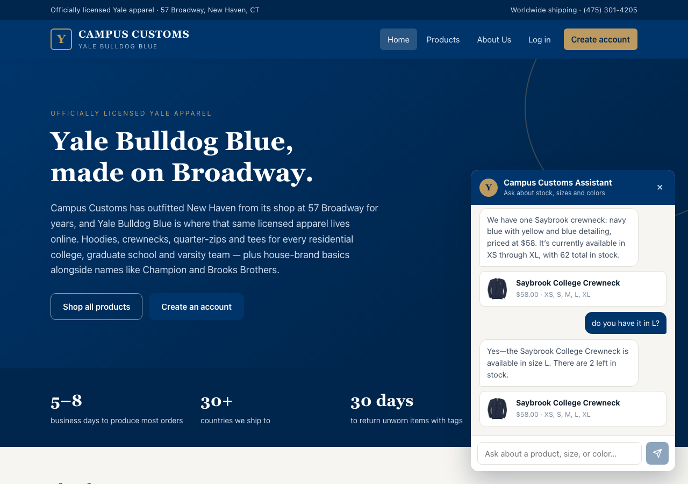

**Clicking a product card in chat** opens that product's page.

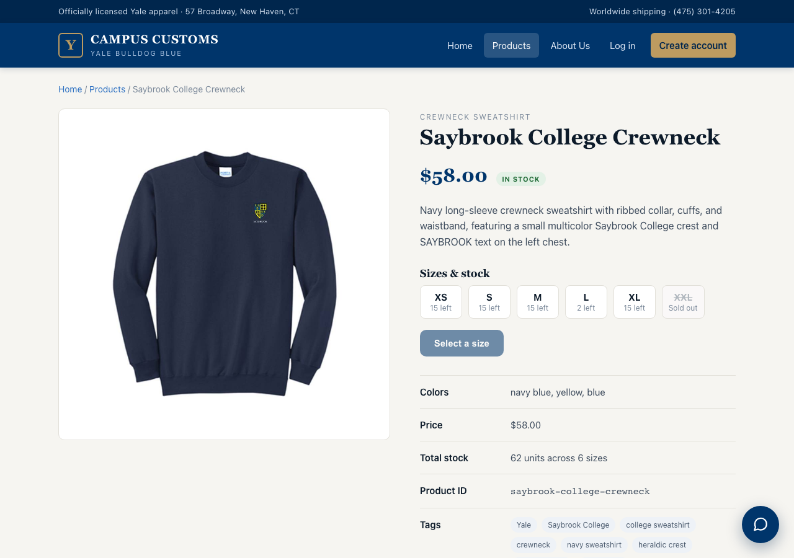

## Problem 6 — Tools: product info and stock

### Prompt typed

> Problem 6: Tools: product info and stock
>
> Build on the existing agent tools so the agent uses data/campus_customs.db to get real product descriptions, prices, and stock quantities, including stock by size
>
> Make sure the agent always gets its answeres from the data base and never invents anything. If the inventory or stock is 0, the angent must clearly tell the customer that that size or product is out of stock.
>  For price and stock questions, update backend/prompts/prompt.md so it knows to use the database tools.
>
> Update or add the structured return types in backend/models.py for the  tools
>
> Test real products against the database including tests for description, price, in-stock size, and out-of-stock size
>
> Update output/harness.md with a list of each tool and a short explanation of which model fields it used for each lookup results and why.

### Follow-up prompt

No follow-up prompt was needed for Problem 6.

### Why a follow-up was needed

Not applicable. The first prompt set the rule the work had to satisfy (answers always from the
database, never invented), called out the specific behaviour that needed to change (an explicit
out-of-stock message when quantity is 0), named the three files to update, listed the four cases
the tests had to cover — description, price, in-stock size, out-of-stock size — and said what the
`output/harness.md` entry had to contain.

### Screenshot of the result

**A sold-out size, answered in the website chat.** The card lists only the sizes that can
actually be bought.

## Problem 7 — Chat search that updates the page

### Prompt typed

> Problem 7: Chat search that updates the page
>
> Adding a feature to the website so that when a customer asks the chatbot about a type of product (for examplewhat hoodies do you have?) you need to use the agent's catalogue search and structured product results to dynamically show the matching product cards on the website (including image, name, price, and short info)
>
> Keep the API contract structured: the agent returns product matches and the frontend renders them.
>
> Make sure these dynamically displayed cards are clickable and open the same product detail page from problem 3 we did earlier  with the large image and full product info
>
> Update backend/prompts/prompt.md so the agent knows to return matching products for the catalogues searches
>
> Also update output/harness.md to explain how the structured search results travel to to the frontend and become product cards

### Follow-up prompt

> Test the feature through the website

### Why a follow-up was needed

The build itself did not need a correction. The first prompt gave the behaviour to add, the four
fields each card had to show, the constraint that the API contract stay structured with the agent
returning matches and the frontend rendering them, the requirement that the cards open the
Problem 3 detail page, and the two files to update.

The follow-up asked for the feature to be exercised the way a customer would, in a clean browser
on the real site, rather than through the API or in pieces. That is a different test from the ones
the build ran: it checks the behaviour a shopper actually meets — the grid visibly changing behind
the chat, the card they click landing on the right page, and the page returning to normal
afterwards.

### Screenshots of the result

**A chat answer redrawing the Products grid** — asking "What hoodies do you have?" replaces the
102-product grid with the agent's six matches, as full cards.

**A chat result opening the full product page**, with the large image and per-size stock.

## Problem 8 — Customer memory

### Prompt typed

> Problem 8: Customer memory
>
> For loggedin users, save chat history in the database  in appropriate table and reload it when they return. For guests or people who are not logged in theycan still chat but no need to save and remember the chat history.
>
> Make sure the agent knows who it is talking to and which custormer is logged in including user's name and email
>
> Pass the current page/product context to the agent so when the customer asks  questions like do you have this in pink? The agent knows what "this" refers toand uses real catalogue data to answer
>
> Test saved history by logging in then out and then back in again. Also test product page "this" question
>
> Update output/harness.md with how history is stored/reloaded, what customer info the agent sees, and how page context is passed and reaches the agent.

### Follow-up prompt

> test it

### Why a follow-up was needed

The build itself did not need a correction. The first prompt drew the line between signed-in
customers and guests, said what the agent had to know about the customer, described the "do you
have this in pink?" case precisely enough to show what page context was for, named the two tests
to run, and listed the three things `output/harness.md` had to explain.

The follow-up asked for the whole feature to be exercised again from a clean slate, through the
website, rather than trusted on the strength of the runs done while building it. That matters more
here than elsewhere: Problem 8 had already turned up one bug that earlier testing missed, so a
fresh pass on a new account — with no history to begin with, watching the rows appear and come
back — is the check worth having.

It was, and a later "have you fixed everything?" prompted a full regression across Problems 3-8
that found one more. The clean-slate run found two bugs about product counts rather than the
products themselves. A plural query like "hoodies" matched nothing, and a category filter using the
shopper's word ("hoodie") missed the four hoodies the data calls "hooded sweatshirt". The regression then found that "this" on a product page lost to a long chat history. All
three are written up in `output/harness.md`.

Worth recording for its own sake: this problem surfaced a bug that predated it. Adding
per-request context revealed that the system prompt was never reaching the model on any turn that
carried history, so from the second turn of every conversation onward the agent had been running
with no voice, no safety rules and no database rules. It is written up in `output/harness.md`.

### Screenshots of the result

**Chat history restored** after signing out and signing back in from a brand-new browser.

**"Do you have this in pink?"** answered from the product page, with real colors and stock.

## Hardening pass

### Prompt typed

> fix everything it needs to work properly

### Follow-up prompt

No follow-up prompt was needed.

### Why a follow-up was needed

Not applicable. The instruction was to close out the remaining caveats and audit for anything else
rather than wait for it to surface. That produced five fixes, written up at the end of
`output/harness.md` — the significant one being that a product sold out in every size could be
pushed past the search limit and so appear not to be carried at all.

## Problem 9 — Usability improvements

### Prompt typed

> Problem 9: Usability improvements
> Choose and implement:
> -	2 useful frontend usability improvements
> -	2 useful agent/backend usability improvements
>
> Pick improvements that fit the existing Campus Customs site and meke it look betterm, improve ease of use, and agent/backend improvement such as  agent quality, accuracy, safety, speed, or cost. Make them new agents tools or things that make agent cheaper or faster
> Create output/usability.md and, for each of the 4 improvements briefly explain what you added and why it helps the shopper or business
>
> Test that all improvements actually work in the running app.

### Follow-up prompt

No follow-up prompt was needed for Problem 9.

### Why a follow-up was needed

Not applicable. The first prompt set the count and the split (two frontend, two agent/backend),
the kinds of improvement that would count, the steer towards new tools or cost/speed wins, the
file to create and what each entry had to explain, and the requirement to test them in the
running app.

### What was chosen

| | Improvement |
|---|---|
| Frontend | filter the Products grid by the size you actually wear, and sort by price or name |
| Frontend | a "Recently viewed" strip, kept in the browser |
| Agent | the model returns product **ids**; the backend builds the cards from the catalogue — 94% fewer output tokens and no way for a price or size list to drift |
| Agent | a new `find_in_size` tool — "what do you have in XXL?" in one call instead of nine |

Written up in `output/usability.md`.

### Screenshots of the result

**Size filter and sort** on the Products page.

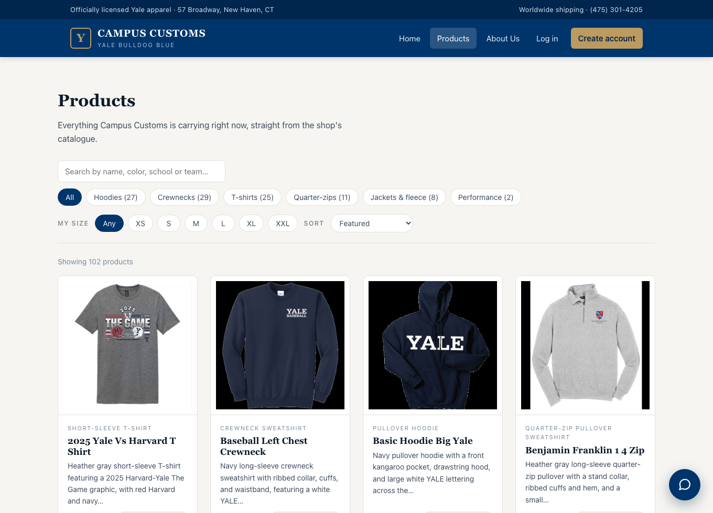

**Recently viewed** strip.

**The `find_in_size` tool** answering "what do you have in XXL under $40?".

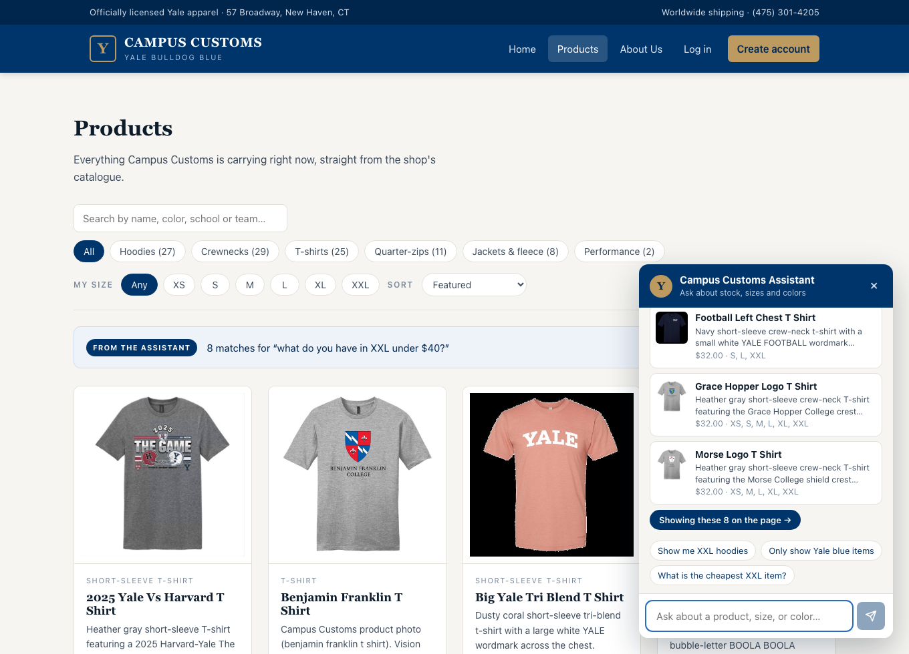

## Problem 10 — Style the website

### Prompt typed

> Problem10: Style the website
>
> Give the existing site a more creative, polished Campus Customs storefront design. Improve the fonts, colors, visuals, motion, product presentation, and chat experience. Make sure you keep alll existing functionality workig
>
> I want a distinctive Yale/Campus Customs feel not a  generic ecommerce template. Make sure it is easy to use a responsive
>
> Create output/design.md with a short and concrete explanation of what you changed and why the design should help customers stay, browse, and buy

### Follow-up prompt

No follow-up prompt was needed for Problem 10.

### Follow-up prompt

> add a labubu next to create account when not logged in and next to the user name when loggin in

### Why a follow-up was needed

The restyle itself did not need a correction. The first prompt named the six areas to improve, set
the constraint that existing functionality keep working, gave the design direction (distinctive
Yale/Campus Customs rather than a generic template) and the usability bar (easy to use,
responsive), and said what `output/design.md` had to explain.

The follow-up added a piece of character the brief had not asked for: a Labubu in the navigation,
in the two places it earns its keep — next to the sign-up button, and next to the name once signed
in. Drawn in SVG rather than added as an image, so it scales, costs no request, and takes its
colours from the site's CSS variables.

One bug was found and fixed during the work: the scroll-reveal animation left everything below the
fold at zero opacity until the page was scrolled, which also meant a blank page in print, to a
crawler, or if the observer ever failed. The reveal now only hides once JavaScript has opted in,
shows anything already on screen immediately, and has a timeout failsafe.

### Screenshots of the result

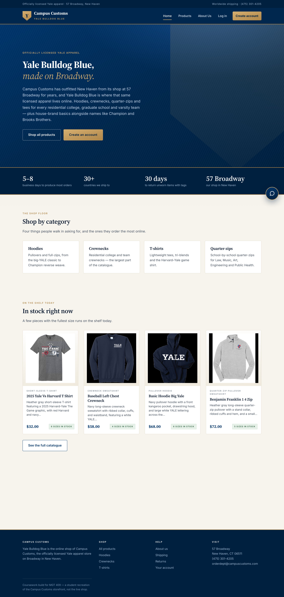

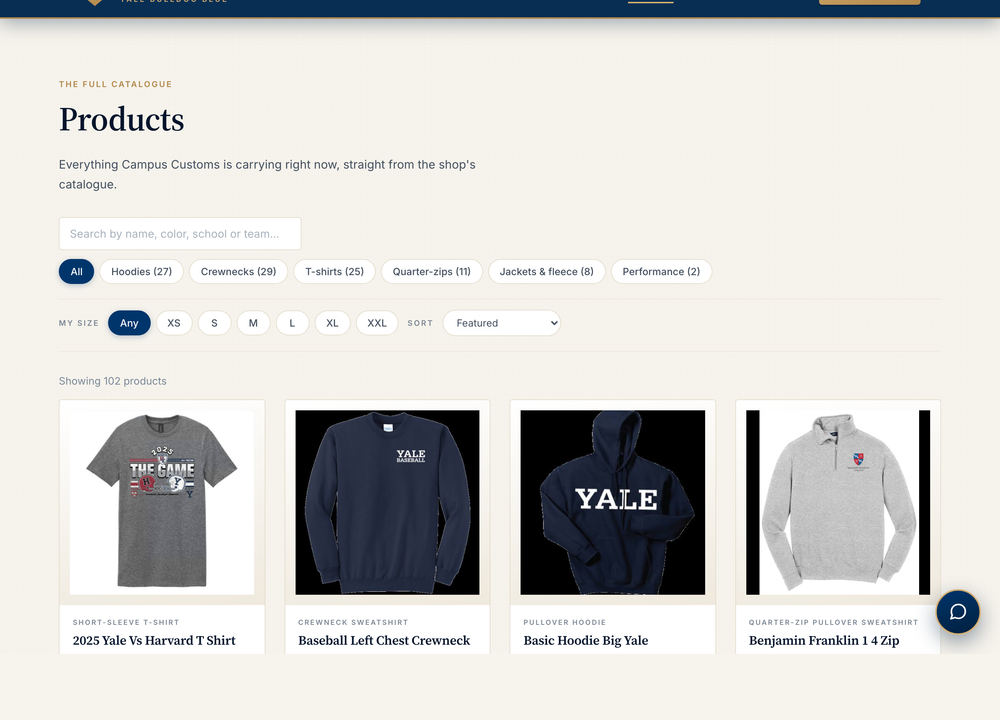

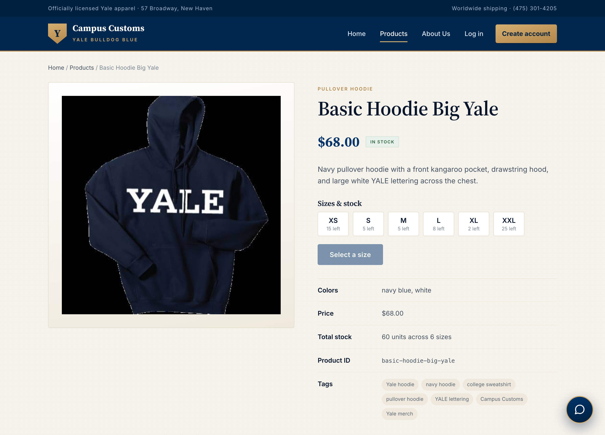

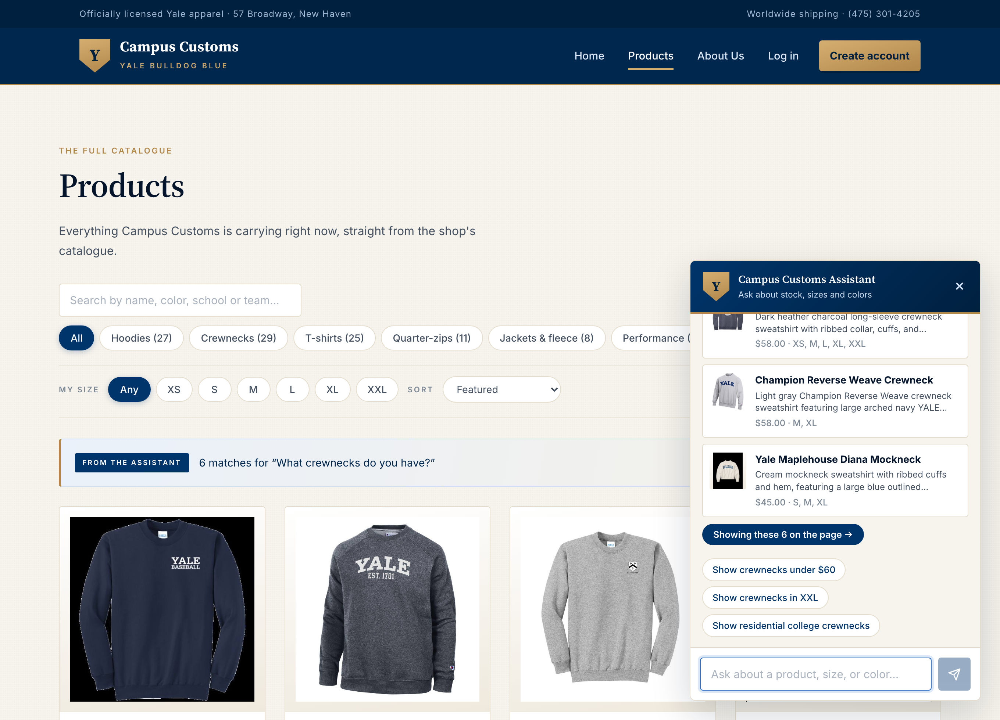

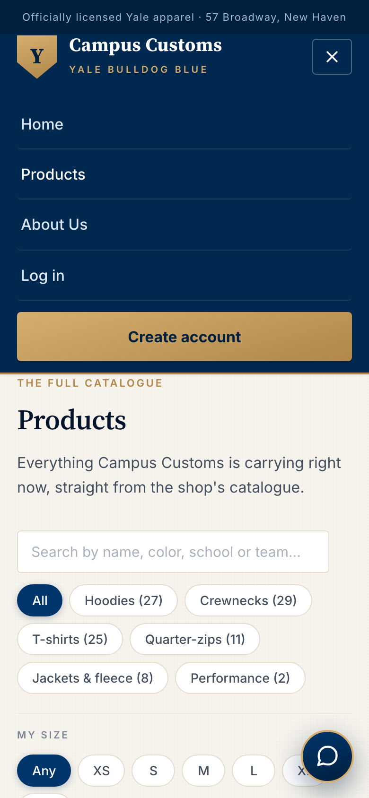

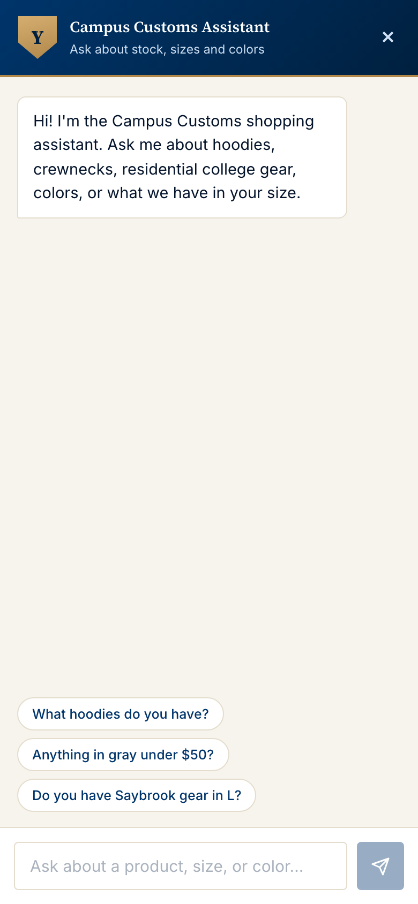

**The Labubu**, signed out and signed in.

## Problem 11 — Site testing (app check)

### Prompt typed

> Problem 11: Site testing (app check)
> Test the live site and create output/app_check.html (webpage that can be opened with double click directly in a browser) to document it
>
> Include 3 labeled checks with screenshots:
>
> -	Chat showing a real item's inventory and price from the database
> -	Dynamic product cards appearing after a category question such as What hoodies do you have?
> -	One usability feature that we added ealier inProblem 9
>
> For each check make sure to include a heading, screenshot, and 1 or 2 sentences explaining what it proves
>
> Save the screenshots in output/app_check_images/ and reference them with relative paths from the HTML app_check.htm (for example app_check_images/inventory.png )

### Follow-up prompt

No follow-up prompt was needed for Problem 11.

### Why a follow-up was needed

Not applicable. The first prompt named the file to create and that it had to open by double-click,
listed the three checks, said each needed a heading, a screenshot and one or two sentences on what
it proves, and gave the folder and the relative-path form for the images.

### What was produced

`output/app_check.html` — a single self-contained page, styled to match the storefront, with the
three checks captured live against the running site. Each check carries a short table comparing
what was observed on screen to what `campus_customs.db` actually holds, so the claim is checkable
rather than asserted. The screenshots live in `output/app_check_images/` and are referenced as
`app_check_images/<name>.png`.

Verified by opening the file over `file://` rather than through a server: all three images load,
every path is relative, no failed requests, no console errors, and no horizontal scrolling at
phone width.

## Problem 12 — Audit trail, safety, finish harness

### Prompt typed

> Problem 12: Audit trail, safety, finish harness
>
> Add an append-only output/audit_trail.json that records agent-loop activity, including timestamp, tool name, short arguments/result, and stop reason. Make sure it keeps previous entries between runs and does not overwrite them
>
> Review and make the safety rules stronger in backend/prompts/prompt.md making sure you keep them appropriate for a shopping assistant
>
> In output/harness.md clearly explain how the system works including:
>
> -	important fields in models.py and why they exist
> -	agent tools and abilities
> -	safety rules
> -	specs such as loop limits, result caps, model used, and how to run the frontend and backend

### Follow-up prompt

No follow-up prompt was needed for Problem 12.

### Why a follow-up was needed

Not applicable. The first prompt named the file to add and the fields it had to carry, set the
append-only requirement explicitly, asked for the safety rules to be strengthened while staying
appropriate to a shopping assistant, and listed the four things the harness had to explain.

### What was produced

`backend/audit.py` and `output/audit_trail.json` — one entry per tool call and one per turn,
sharing a run id, with the stop reason on the run. Appending truncates only the trailing `]`, so
earlier entries are never rewritten; verified across a backend restart and under 100 concurrent
writes.

The safety rules in `prompts/prompt.md` were rewritten into five groups and spot-checked live
against a fake-authority discount request, a fit-and-fabric question the catalogue cannot answer,
a "developer mode" data dump, a shipping-and-duty total, and a message expressing distress.

`output/harness.md` gained a full *How the system works* reference: run commands, specs, the
important `models.py` fields and why each exists, the six tools and their caps, the safety rules,
and how the audit trail is written.

## Problem 13 — Push to GitHub and submit the URL

### Prompt typed

> Problem 13: Push to GitHub and submit the URL
>
> Prepare the finished project for GitHub submission
>
> Make sure the project is inside a folder named hw4 and matches the required layout (see attached schreenshot). I will need to submit a repo URL
>  Before pushing, verify that Git does NOT include:
>
> -	.env or any real API keys/secrets
> -	data/campus_customs.db
> -	data/products/ or product images
> -	other local/generated files that should not be submitted
>
> Update .gitignore as needed and include .env.example with placeholder values only
>
> Check that README.md clearly explains how to run the fron and back end after placing the local data pack
>
> Before finalizing the project make dure you update also AI_prompts.md with this Problem 13
>
> Push the hw4 project to a public GitHub repository and give me the repo URL to submit on Canvas

### Follow-up prompt

No follow-up prompt was needed for Problem 13.

### Why a follow-up was needed

Not applicable. The first prompt gave the required folder name and layout, listed exactly what
Git must not include, asked for `.gitignore` and a placeholder-only `.env.example`, set the bar
for the README, said to log this problem here too, and said where to push.

### What changed for submission

- The project folder was renamed from `HW4` to **`hw4`** and `requirements.txt` moved from
  `backend/` to the project root, to match the required layout.
- `.gitignore` was rewritten to exclude the local-only data pack (`data/`, `data.zip`), the
  virtual environment, `node_modules`, build output, `.env`, `backend/.session_secret`, and macOS
  cruft — while keeping `.env.example`.
- `.env.example` was added with placeholders only.
- `README.md` now opens with placing the data pack, then the backend on port 8000 and the
  frontend on port 5180, in that order.

Before pushing, the staged tree was scanned: **zero** occurrences of the real Portkey key, the
session secret, any `sk-`/`gho_` token or a password hash, and no `.env`, database file, product
image, `data.zip`, `node_modules` or `.venv`.
