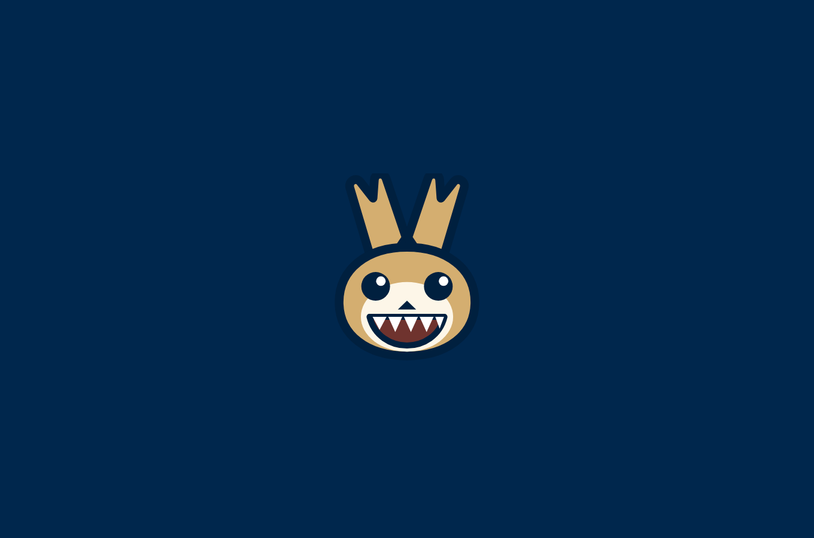
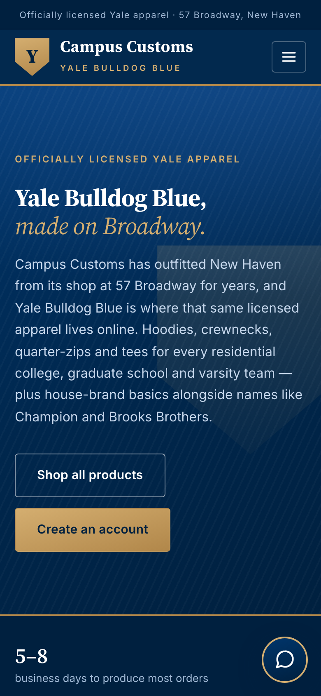
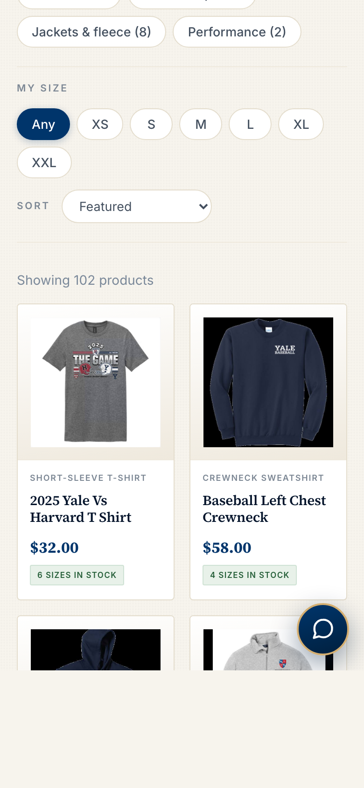

# Campus Customs — design

The old site worked but looked like a storefront template with Yale blue painted on. This pass
rebuilds the surface around one idea: **a printed New Haven shop, not a generic online store.**
Warm paper instead of clinical white, brass instead of drop shadows, a shield instead of a rounded
square, and a serif that reads like a course catalogue. Every function from Problems 3–9 still
works; nothing was renamed or removed.

---

## Typography

Two typefaces doing clearly different jobs.

- **Source Serif 4** for anything that *speaks* — headings, prices, the wordmark, the stat figures.
  It is an academic text serif, so it reads as New Haven rather than as a luxury brand.
- **Inter** for anything that is a *control* — buttons, chips, labels, form fields, body copy.
- A third voice, used sparingly: small uppercase with wide tracking in brass, for eyebrows like
  THE FULL CATALOGUE and PULLOVER HOODIE. It is what gives the pages their catalogue-page feel.

The hero splits across two lines, the second in italic brass — "Yale Bulldog Blue, *made on
Broadway.*" One typographic gesture carries the whole brand.

**Why it helps.** Prices in a serif read as considered rather than as a discount sticker, and the
serif/sans split means a shopper can tell at a glance what is information and what is a thing to
click.

## Color

| | |
|---|---|
| Yale blue `#00356b` | the anchor — buttons, prices, active states |
| Navy `#00274d` / `#00203f` | the navigation bar and footer, so the chrome frames the page |
| Brass `#b1874a` → `#d4ae70` | the accent: shield, hairlines, eyebrows, the primary call to action |
| Warm paper `#f7f4ed` | the page, instead of grey-white |

Brass replaces a second blue as the accent. Two blues read as a corporate site; blue against brass
reads like a crest, and gives the "Create account" button somewhere to be the brightest thing on
screen without shouting. A faint dotted texture sits over the whole page — invisible as detail,
but it stops the large flat areas looking like unstyled background.

## Visuals

- **A shield, not a rounded square.** The brand mark, the chat avatar and a 640px watermark bled
  off the right of the hero all use the same clipped shield. It is the one shape the site repeats,
  so it does the work a logo would.
- **Product photography on warm gradients.** Cards and the detail image sit on a white-to-paper
  gradient instead of flat white, so a navy hoodie photographed on black does not float in a void.
- **Brass hairlines** mark the edges that matter: under the nav, above and below the stats stripe,
  across the top of the sign-in panel.
- **Squared corners** (4px, not 10px). Printed, not bubbly.

## Motion

Restrained and purposeful — every animation either confirms an action or directs attention.

- Product cards lift 5px and the photograph scales 1.055 on hover, so the whole card feels like
  one object you are picking up.
- Navigation links draw a brass underline from the left.
- Sections fade up as they scroll in — but see the note below.
- Chat messages and the panel itself animate in; the typing dots are brass.
- The assistant's result banner slides down, so a shopper notices the grid behind the chat has
  changed.

**All of it is off** under `prefers-reduced-motion`, and the reveal is built so it can never hide
content: the hidden state only applies once JavaScript has opted in, anything already on screen is
shown immediately rather than waiting for a scroll, and a timeout reveals anything left. Without
JavaScript, in print, or to a crawler, the page is simply visible.

## Product presentation

Cards now carry a brass-tracked garment type above the name, the name in serif, the price in
serif, and the stock badge on the same line. The detail page pins the photograph while the
specifications scroll beside it, and sold-out sizes are dashed and struck through rather than
merely greyed, so the difference is visible without reading.

## The chat

The panel reads as a member of staff rather than a widget: a brass shield avatar, a blue gradient
header with a brass rule under it, serif name. Messages animate in. Product cards inside the chat
gained a two-line description and slide right on hover. **On a phone the panel goes full-screen** —
a 396px floating box on a 375px screen was unusable.

## The Labubu

A small Labubu sits in the navigation — beside **Create account** when signed out, and beside the
customer's name when signed in. It is **drawn in SVG in `components/Labubu.tsx`**, not an image
file: the whole creature is paths, so it scales to any size, costs no network request, and is
coloured from the same CSS variables as the rest of the site. There are no image assets in
`frontend/src` at all.

It is built to survive being 22px tall: the ears are exaggerated and notched, the eyes are large
and simple, and the teeth are triangles rather than squares, because at that size rectangles blur
into a white bar. In the brass "Create account" button the fur switches to a pale cream so it
stays legible against the gold. On hover the ears wiggle and the whole thing hops once — and not
at all under `prefers-reduced-motion`.

It is `aria-hidden`, since it sits beside a label that already says what the control does.

**Why it helps.** Campus Customs is a shop students actually walk into, and the two places a small
piece of character is worth most are the moment you are asked to make an account and the moment
you are greeted by name. It makes signing up feel like a shop with a personality rather than a
form, and it gives the signed-in state a visible marker at a glance.

## Responsive

- A real mobile menu: the links collapse behind a toggle that opens, closes on navigation, and
  stacks the call to action full-width.
- Two product columns at phone widths, with the blurb hidden and type sizes stepped down so a card
  stays scannable at 158px.
- The detail page stacks, and the sticky photograph un-sticks.
- Forms go single-column; the specification list drops its label column.
- The page reserves space at the bottom so the floating chat button never covers the last row.

Verified at **320, 375, 414, 768, 1024, 1280 and 1600px** — no horizontal scrolling at any of them.

---

## Why this should help customers stay, browse and buy

**Stay.** The first screen has to answer "is this the real shop?" in a second. A shield, a serif
wordmark, the Broadway address in the top bar and a brass rule do that faster than a photograph
would. Immediately below, four concrete numbers — 5–8 days, 30+ countries, 30-day returns, 57
Broadway — answer the next three questions before they are asked.

**Browse.** The catalogue is 102 near-identical navy garments; the work of the design is making
them separable. The eyebrow gives every card a category before the name, the gradient separates
the photograph from the page, and the hover lift makes the grid feel handleable rather than like a
spreadsheet. Skeleton cards hold the grid's shape while it loads, so nothing jumps.

**Buy.** The things a purchase depends on are now the most legible things on the page: the price
in large serif, stock per size as real numbers, and sold-out sizes visibly struck through rather
than quietly disabled. Brass is reserved almost entirely for the actions — create an account, ask
the assistant — so the eye lands on them without a single thing on the page shouting.

---

## Everything still works

Re-run after the restyle:

- **28/28** browser checks across Problems 3–8 — pages, category and search filters, login,
  agent accuracy, safety, chat-driven grid updates, page context, chat memory.
- **21/21** Problem 9 checks — size filter, sort, recently viewed, ids-to-cards, `find_in_size`.
- **62/62** tool tests against the database.
- **14/14** responsive and motion checks.
- No console errors anywhere.

Mobile — home, catalogue, menu, and the full-screen chat:

